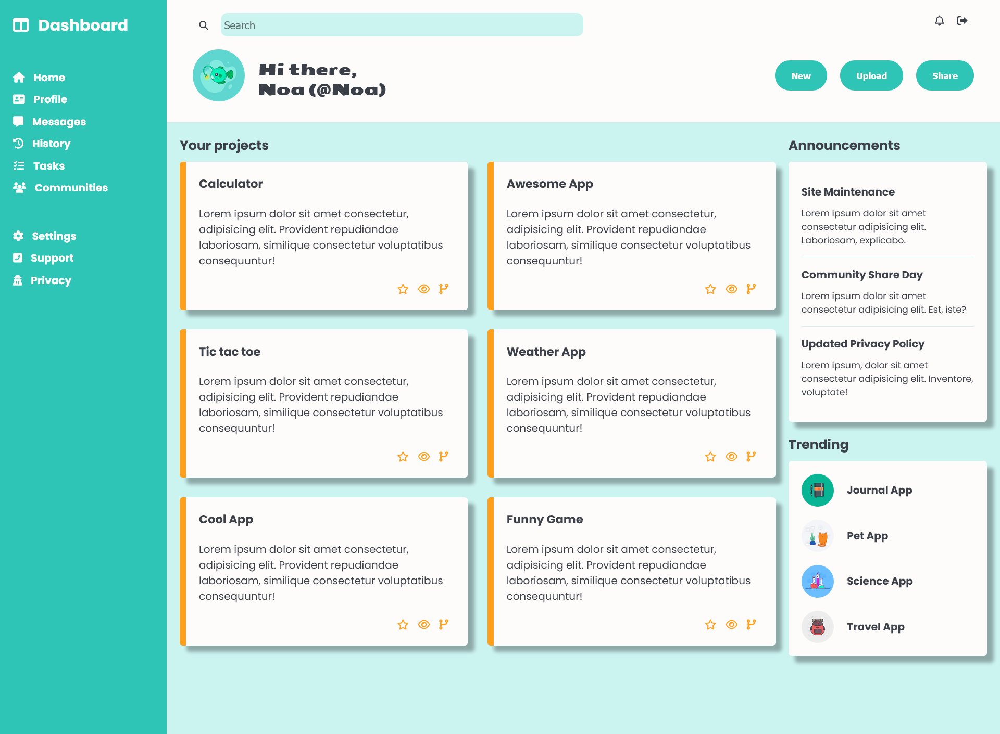

# Admin Dashboard

    

<a href="https://noasalgado.github.io/Admin-Dashboard/">Live Demo </a>

## About The Project

This is the second project of the intermediate HTML and CSS course in the [Odin Project](https://www.theodinproject.com/lessons/node-path-intermediate-html-and-css-admin-dashboard) curriculum.

Is a single static page website, which aims to put into practice the knowledge about grid acquired in the module

## Built With

- HTML
- CSS (Grid and Flexbox)

## Resources Used

- [Google Fonts](https://fonts.google.com/knowledge) - Typography
- [FontAwesome](https://fontawesome.com/) - Icons
- [Illustration](https://illlustrations.co/) - Avatar pictures
